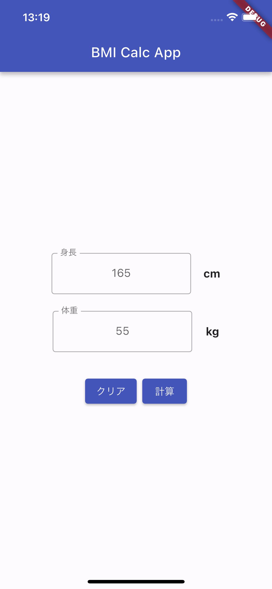
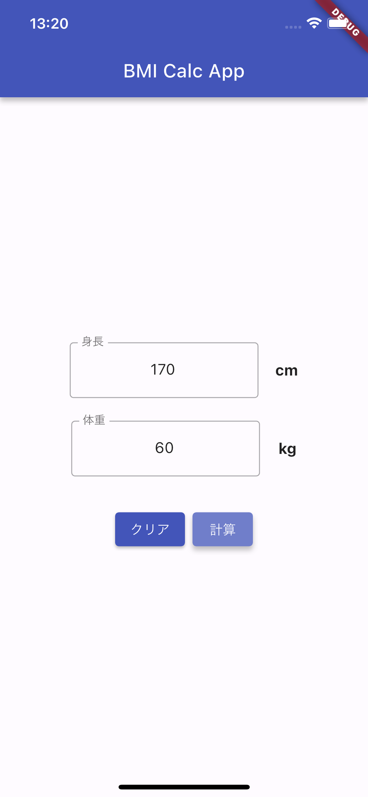
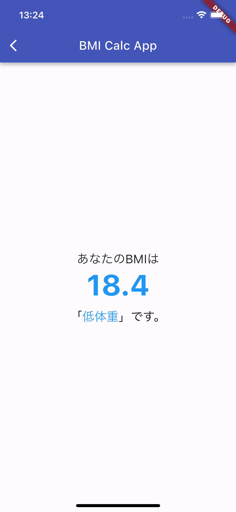
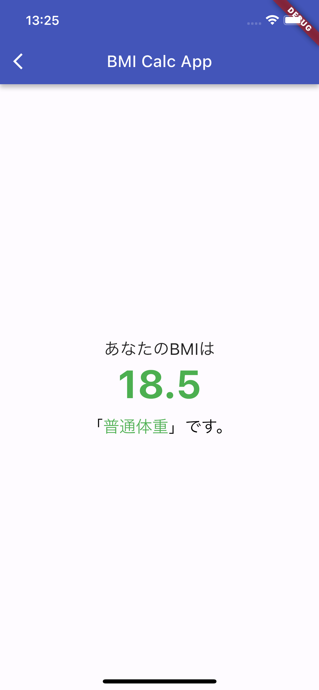
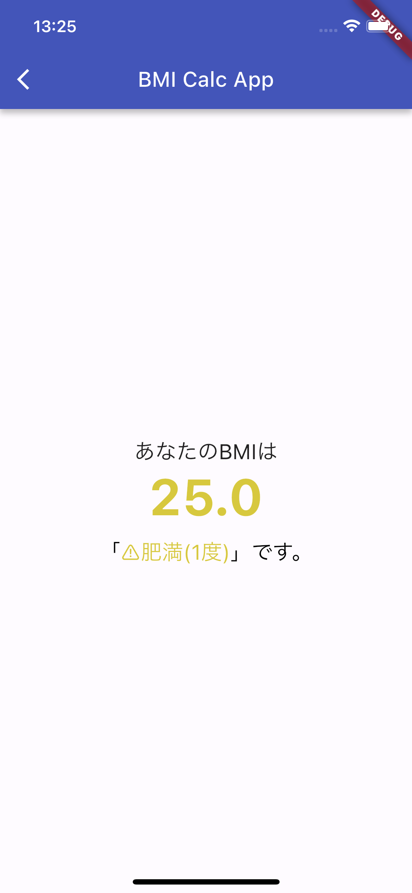
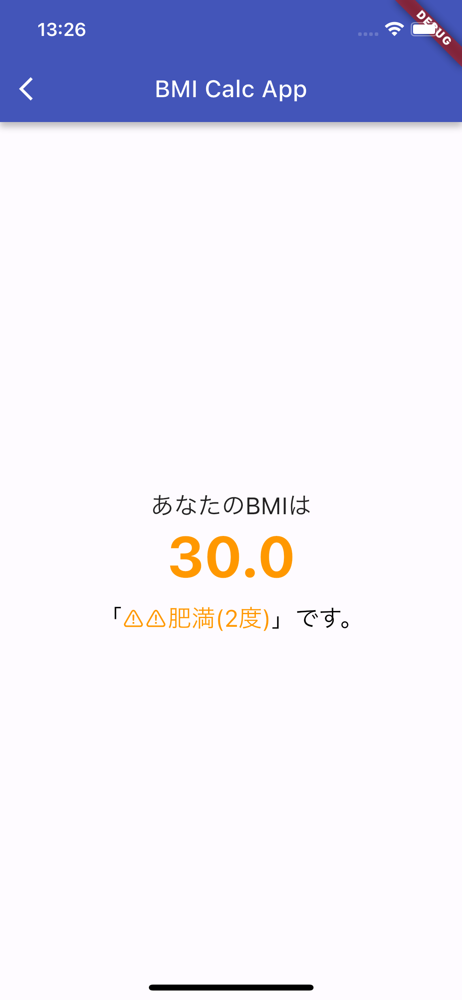
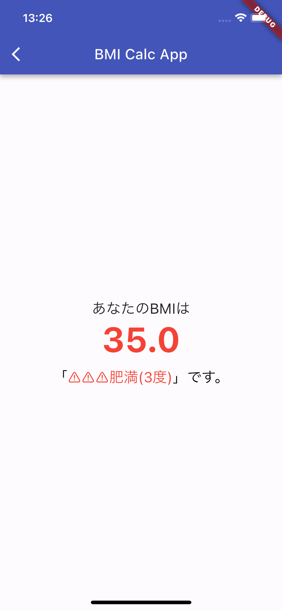
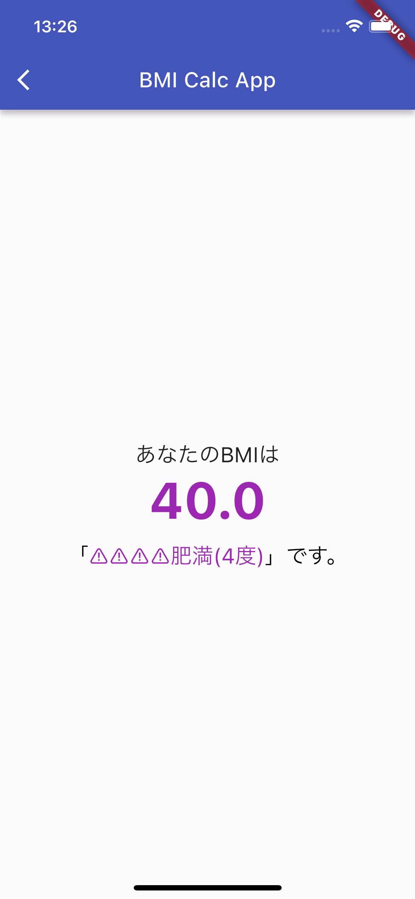

# calc_bmi_app
- Riverpod(v2.0)を使用して状態管理
  - riverpod_generatorを使用
  - Riverpodで行っていること
    - 計算
    - 肥満度の設定
      - [厚生労働省](https://www.e-healthnet.mhlw.go.jp/information/food/e-02-001.html)の定義に従う
    - 肥満度ごとの文字色の設定

## フォルダ構成
- libフォルダ配下の構成
```
.
├── components
│   ├── clear_button.dart
│   ├── height_text_form.dart
│   ├── obesity_text.dart
│   └── weight_text_form.dart
├── constants
│   ├── colors.dart
│   ├── dimens.dart
│   ├── numbers.dart
│   └── strings.dart
├── main.dart
├── result.dart
├── result.g.dart
└── screen
    ├── input_screen.dart
    └── result_screen.dart
```

## アプリデザイン
**入力画面**

| 画面表示時 | 入力時 |
--- | ---
 | 
 
**計算結果画面**

| 低体重 | 普通体重 | 肥満(1度) |
 --- | --- | ---
|  |  |  |


| 肥満(2度) | 肥満(3度) | 肥満(4度) |
 --- | --- | ---
|  |  |  |